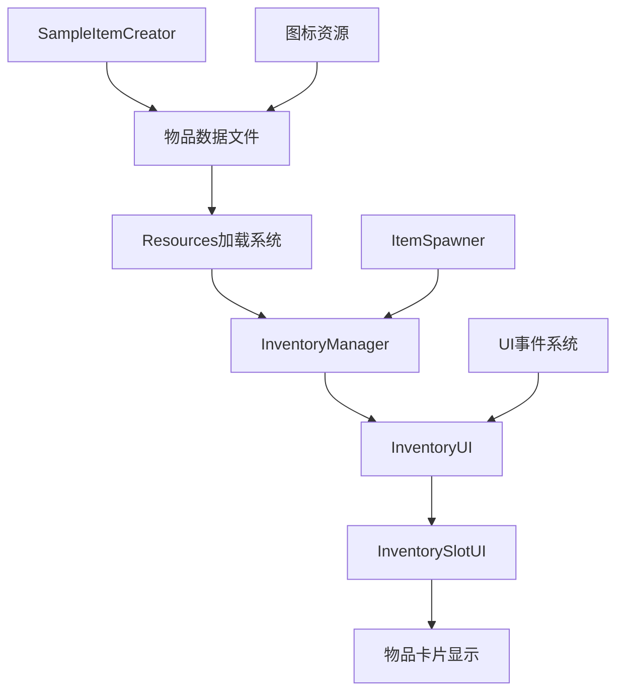
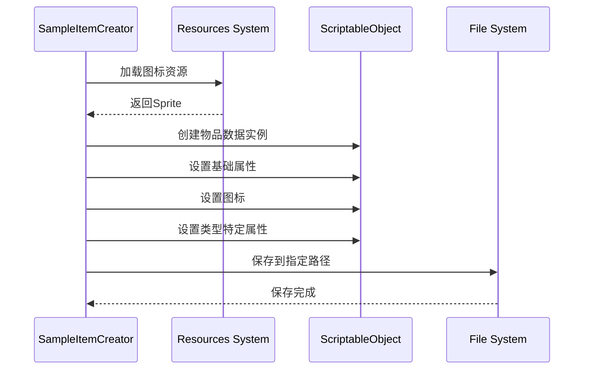
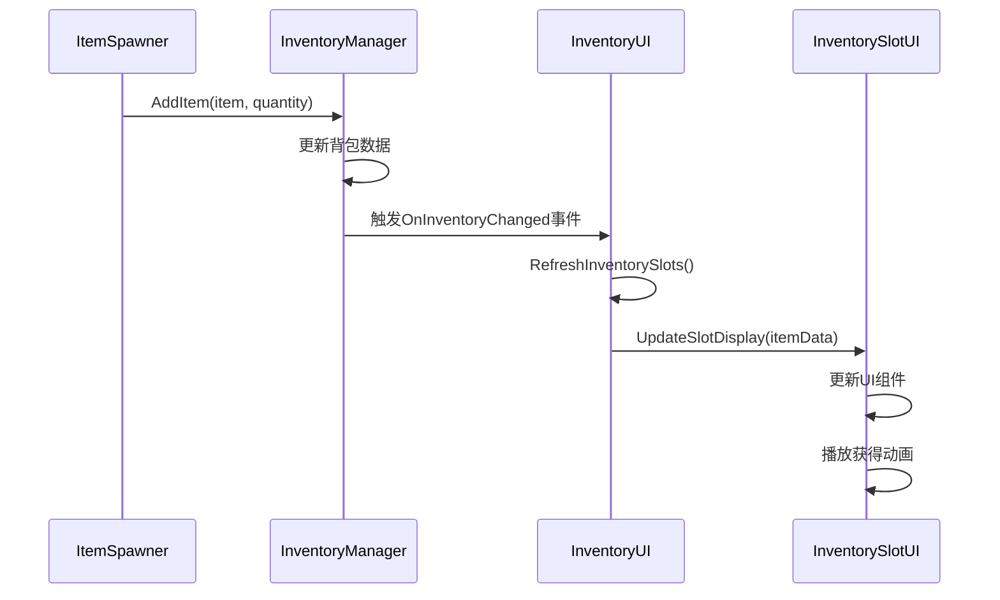

# 背包系统UI增强设计文档

## 系统架构概览

本设计基于现有的背包系统架构，通过增强物品数据创建器和UI显示系统来提供更完整的用户体验。



## 核心组件设计

### 1. 增强的SampleItemCreator

#### 1.1 架构设计
```csharp
public class EnhancedSampleItemCreator : MonoBehaviour
{
    // 数据定义结构
    private struct ItemDefinition
    {
        public string name;
        public string description;
        public string iconName;
        // 类型特定属性
    }
    
    // 创建流程
    private void CreateItemWithFullData(ItemDefinition definition, ItemType type)
    {
        // 1. 创建ScriptableObject实例
        // 2. 设置基础属性
        // 3. 加载并设置图标
        // 4. 设置类型特定属性
        // 5. 保存到指定路径
    }
}
```

#### 1.2 数据结构设计
- **武器数据预设**：包含10种不同武器的完整属性
- **装备数据预设**：包含12种不同装备的完整属性
- **消耗品数据预设**：包含8种不同消耗品的完整属性

#### 1.3 资源管理策略
- **路径标准化**：使用常量定义所有资源路径
- **图标加载**：通过Resources.Load动态加载图标
- **错误处理**：图标缺失时使用默认图标
- **批量操作**：支持一键创建所有物品数据

### 2. 背包UI系统重构

#### 2.1 UI层次结构
```
InventoryUI (主控制器)
├── InventoryPanel (背包面板)
│   ├── HeaderPanel (标题栏)
│   │   ├── TitleText (背包标题)
│   │   ├── StatusText (状态显示: 0/20)
│   │   └── CloseButton (关闭按钮)
│   ├── TabPanel (标签页面板)
│   │   ├── WeaponTab (武器标签)
│   │   ├── EquipmentTab (装备标签)
│   │   └── ConsumableTab (消耗品标签)
│   ├── ContentPanel (内容面板)
│   │   └── SlotGrid (槽位网格)
│   │       ├── InventorySlot[0-19] (20个槽位)
│   │       └── ...
│   └── InfoPanel (物品信息面板)
│       ├── ItemIcon (物品图标)
│       ├── ItemName (物品名称)
│       ├── ItemDescription (物品描述)
│       └── ItemAttributes (属性列表)
```

#### 2.2 槽位UI组件设计
```csharp
public class EnhancedInventorySlotUI : MonoBehaviour
{
    // UI组件
    [Header("基础UI")]
    public Image backgroundImage;
    public Image itemIcon;
    public Text itemName;
    public Text quantityText;
    
    [Header("状态指示")]
    public Image qualityBorder;  // 品质边框
    public Image typeIcon;       // 类型图标
    public GameObject cooldownOverlay; // 冷却遮罩
    
    [Header("动画效果")]
    public Animator slotAnimator;
    
    // 状态管理
    private SlotState currentState;
    private ItemDisplayData displayData;
}
```

#### 2.3 物品卡片显示系统
- **分层显示**：背景、图标、文字、特效分层管理
- **动态适配**：根据物品类型调整显示内容
- **状态指示**：通过颜色和图标表示物品状态
- **动画效果**：物品获得、使用时的视觉反馈

### 3. 数据流设计

#### 3.1 物品数据创建流程


#### 3.2 UI更新流程


## 组件接口设计

### 1. IItemDataCreator接口
```csharp
public interface IItemDataCreator
{
    void CreateAllItems();
    void CreateWeapons();
    void CreateEquipments();
    void CreateConsumables();
    bool ValidateResources();
}
```

### 2. ISlotDisplayController接口
```csharp
public interface ISlotDisplayController
{
    void UpdateDisplay(InventorySlot slot);
    void PlayAnimation(string animationType);
    void SetInteractable(bool interactable);
    void ShowTooltip(Vector2 position);
    void HideTooltip();
}
```

### 3. IInventoryUIManager接口
```csharp
public interface IInventoryUIManager
{
    void InitializeSlots(int slotCount);
    void RefreshAllSlots();
    void RefreshSlotsByType(ItemType type);
    void UpdateStatusDisplay();
    void SetActiveTab(ItemType type);
}
```

## 数据模型设计

### 1. 物品显示数据结构
```csharp
[System.Serializable]
public class ItemDisplayData
{
    public string displayName;
    public string description;
    public Sprite icon;
    public Color qualityColor;
    public Sprite typeIcon;
    public List<AttributeDisplay> attributes;
    public bool showQuantity;
    public bool showCooldown;
}
```

### 2. 属性显示结构
```csharp
[System.Serializable]
public class AttributeDisplay
{
    public string attributeName;
    public string attributeValue;
    public Color valueColor;
    public Sprite attributeIcon;
}
```

### 3. 槽位状态枚举
```csharp
public enum SlotState
{
    Empty,          // 空槽位
    Occupied,       // 有物品
    Highlighted,    // 高亮状态
    Disabled,       // 禁用状态
    Animating       // 动画中
}
```

## UI样式设计

### 1. 视觉层次
- **主要信息**：物品图标、名称 (最显眼)
- **次要信息**：数量、类型标识 (中等显眼)
- **辅助信息**：边框、背景效果 (最不显眼)

### 2. 颜色方案
```csharp
public static class ItemQualityColors
{
    public static readonly Color Common = new Color(0.8f, 0.8f, 0.8f);    // 灰色
    public static readonly Color Uncommon = new Color(0.2f, 0.8f, 0.2f);  // 绿色
    public static readonly Color Rare = new Color(0.2f, 0.4f, 1.0f);      // 蓝色
    public static readonly Color Epic = new Color(0.8f, 0.2f, 0.8f);      // 紫色
    public static readonly Color Legendary = new Color(1.0f, 0.6f, 0.0f); // 橙色
}
```

### 3. 动画设计
- **获得物品**：缩放+闪光效果 (0.3秒)
- **使用物品**：淡出+粒子效果 (0.5秒)
- **悬停效果**：轻微放大+边框高亮 (0.1秒)
- **拖拽效果**：半透明+跟随鼠标 (实时)

## 性能优化策略

### 1. UI更新优化
- **增量更新**：只更新变化的槽位
- **视图裁剪**：只渲染可见的槽位
- **对象池**：复用UI组件减少GC
- **批量操作**：合并多个UI更新操作

### 2. 资源管理优化
- **预加载**：游戏启动时预加载常用图标
- **异步加载**：大量资源异步加载避免卡顿
- **内存管理**：及时释放不用的资源
- **压缩优化**：使用合适的图片格式和压缩

### 3. 事件系统优化
- **事件聚合**：合并频繁的事件通知
- **延迟更新**：使用协程延迟非关键更新
- **条件更新**：只在必要时触发UI更新
- **取消订阅**：及时取消不需要的事件订阅

## 错误处理设计

### 1. 资源缺失处理
- **图标缺失**：使用默认图标并记录警告
- **路径错误**：自动创建缺失的文件夹
- **数据损坏**：提供数据修复工具
- **版本兼容**：处理旧版本数据格式

### 2. UI异常处理
- **空引用**：检查UI组件引用的有效性
- **数据不匹配**：验证数据与UI的一致性
- **动画中断**：处理动画播放中的状态变化
- **内存不足**：降级显示减少内存使用

## 测试策略

### 1. 单元测试
- **数据创建测试**：验证物品数据的正确性
- **UI组件测试**：测试各UI组件的功能
- **事件系统测试**：验证事件的正确触发和处理
- **性能测试**：测试大量物品时的性能表现

### 2. 集成测试
- **端到端测试**：从物品创建到UI显示的完整流程
- **兼容性测试**：与现有系统的兼容性验证
- **压力测试**：大量操作下的系统稳定性
- **用户体验测试**：UI交互的流畅性和直观性

## 扩展性设计

### 1. 新物品类型支持
- **插件化架构**：支持动态添加新的物品类型
- **配置驱动**：通过配置文件定义物品属性
- **模板系统**：提供物品创建模板
- **自动化工具**：批量生成物品数据的工具

### 2. UI主题支持
- **样式分离**：UI样式与逻辑分离
- **主题切换**：支持多种UI主题
- **自定义化**：允许用户自定义UI外观
- **响应式设计**：适配不同屏幕尺寸

这个设计文档提供了完整的技术架构和实现方案，确保新功能与现有系统的无缝集成，同时保持良好的性能和用户体验。