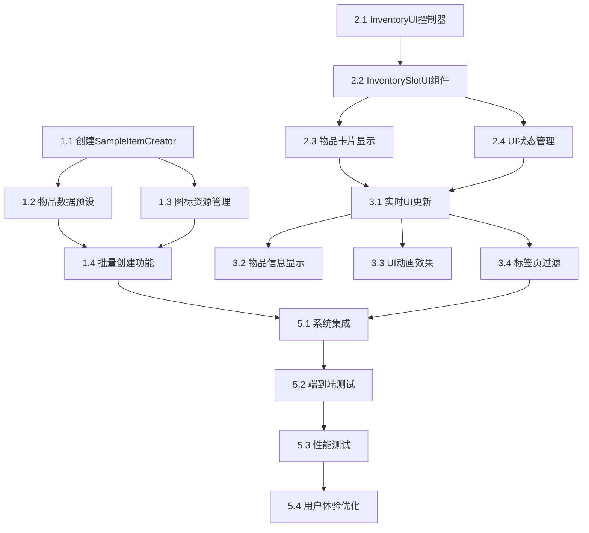

# 背包系统UI增强实现任务

## 任务概述

本任务列表将系统地实现背包系统的UI增强功能，包括完善物品数据创建器和改进背包UI显示系统。

## 实现任务列表

### 1. 增强SampleItemCreator组件

- [ ] 1.1 创建增强的SampleItemCreator脚本
  - 实现完整的物品数据创建功能
  - 支持自动路径管理和文件夹创建
  - 集成图标资源加载系统
  - _需求: 1.1, 1.2_

- [ ] 1.2 实现物品数据预设系统
  - 创建武器数据预设（3种武器：法师杖、精钢匕首、长弓）
  - 创建装备数据预设（2种装备：力量戒指、铁制头盔）
  - 创建消耗品数据预设（2种消耗品：力量药水、生命药水）
  - _需求: 1.1, 1.2_

- [ ] 1.3 实现图标资源管理系统
  - 创建图标加载工具类
  - 实现默认图标处理机制
  - 添加资源验证功能
  - _需求: 1.1_

- [ ] 1.4 实现批量创建和属性设置功能
  - 支持一键创建所有物品类型
  - 自动设置物品的完整属性
  - 实现数据验证和错误处理
  - _需求: 1.2_

### 2. 重构背包UI系统

- [ ] 2.1 创建增强的InventoryUI控制器
  - 重构主UI控制器支持20槽位初始化
  - 实现状态显示更新（使用槽位数/总槽位数）
  - 添加UI初始化和清理逻辑
  - _需求: 2.1_

- [ ] 2.2 实现增强的InventorySlotUI组件
  - 扩展槽位UI支持完整物品信息显示
  - 添加物品图标、名称、数量显示
  - 实现类型标识和品质边框
  - _需求: 2.2, 2.3_

- [ ] 2.3 创建物品卡片显示系统
  - 实现ItemDisplayData数据结构
  - 创建属性显示组件
  - 实现动态内容适配
  - _需求: 2.3_

- [ ] 2.4 实现UI状态管理系统
  - 创建SlotState枚举和状态管理
  - 实现槽位状态切换逻辑
  - 添加状态变化动画效果
  - _需求: 2.2_

### 3. 实现UI更新和事件系统

- [ ] 3.1 实现实时UI更新机制
  - 创建增量更新系统
  - 实现事件驱动的UI刷新
  - 添加批量更新优化
  - _需求: 2.2_

- [ ] 3.2 实现物品信息显示系统
  - 创建悬停信息面板
  - 实现详细属性显示
  - 添加信息面板定位逻辑
  - _需求: 2.2_

- [ ] 3.3 实现UI动画和视觉效果
  - 创建物品获得动画
  - 实现槽位状态变化效果
  - 添加悬停和点击反馈
  - _需求: 2.2_

- [ ] 3.4 集成标签页过滤系统
  - 更新标签页切换逻辑
  - 实现物品类型过滤显示
  - 优化切换性能
  - _需求: 2.2_

### 4. 性能优化和错误处理

- [ ] 4.1 实现UI性能优化
  - 添加对象池管理
  - 实现视图裁剪优化
  - 创建批量操作系统
  - _需求: 技术约束_

- [ ] 4.2 实现资源管理优化
  - 创建资源预加载系统
  - 实现异步资源加载
  - 添加内存管理机制
  - _需求: 技术约束_

- [ ] 4.3 实现错误处理系统
  - 添加资源缺失处理
  - 实现UI异常恢复
  - 创建数据验证机制
  - _需求: 技术约束_

- [ ] 4.4 创建调试和诊断工具
  - 扩展InventoryDebugger功能
  - 添加UI状态监控
  - 实现性能分析工具
  - _需求: 技术约束_

### 5. 系统集成和测试

- [ ] 5.1 集成新组件到现有系统
  - 更新InventoryManager集成新UI
  - 确保ItemSpawner兼容性
  - 测试与现有组件的交互
  - _需求: 3.1_

- [ ] 5.2 实现端到端功能测试
  - 创建完整的功能测试脚本
  - 验证物品创建到显示的完整流程
  - 测试所有交互功能
  - _需求: 验收测试场景_

- [ ] 5.3 性能和稳定性测试
  - 测试大量物品时的性能表现
  - 验证内存使用和GC影响
  - 测试长时间运行的稳定性
  - _需求: 技术约束_

- [ ] 5.4 用户体验优化
  - 调整UI响应速度
  - 优化动画流畅度
  - 完善交互反馈
  - _需求: 2.2, 2.3_

### 6. 文档和维护

- [ ] 6.1 更新使用文档
  - 更新README和使用指南
  - 创建新功能的使用说明
  - 添加故障排除指南
  - _需求: 维护性_

- [ ] 6.2 创建开发者文档
  - 编写API文档
  - 创建扩展指南
  - 添加架构说明
  - _需求: 可扩展性_

- [ ] 6.3 实现自动化测试
  - 创建单元测试套件
  - 实现集成测试
  - 添加回归测试
  - _需求: 质量保证_

## 任务依赖关系

## 验收标准

每个任务完成后需要满足以下标准：

1. **代码质量**: 遵循现有代码规范，包含完整注释
2. **功能完整**: 实现所有设计文档中定义的功能
3. **性能达标**: 不影响现有系统性能
4. **测试通过**: 通过相关的功能和性能测试
5. **文档更新**: 更新相关的使用和开发文档

## 里程碑

- **里程碑1** (任务1.1-1.4): 完成增强的物品数据创建系统
- **里程碑2** (任务2.1-2.4): 完成背包UI系统重构
- **里程碑3** (任务3.1-3.4): 完成UI更新和事件系统
- **里程碑4** (任务4.1-4.4): 完成性能优化和错误处理
- **里程碑5** (任务5.1-5.4): 完成系统集成和测试
- **里程碑6** (任务6.1-6.3): 完成文档和维护工具

每个里程碑完成后进行代码审查和功能验证，确保质量和进度。