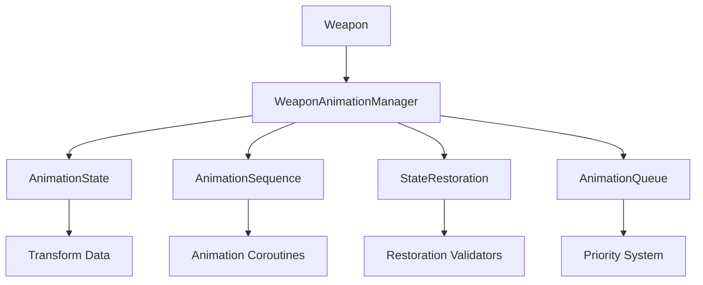

# Design Document

## Overview

The weapon animation system enhancement focuses on creating a robust, state-safe animation framework that ensures precise restoration of weapon transforms after any animation sequence. The design introduces a centralized animation state manager, improved coroutine handling, and fail-safe restoration mechanisms to eliminate visual inconsistencies and state corruption issues.

## Architecture

### Core Components

1. **WeaponAnimationManager**: Central controller for all weapon animations
2. **AnimationState**: Immutable state container for weapon transform data
3. **AnimationSequence**: Configurable animation definition with restoration guarantees
4. **StateRestoration**: Fail-safe mechanism for transform restoration
5. **AnimationQueue**: Priority-based animation scheduling system

### Component Relationships



## Components and Interfaces

### WeaponAnimationManager

**Purpose**: Centralized management of all weapon animations with guaranteed state restoration.

**Key Methods**:
- `PlayAnimation(AnimationSequence sequence)`: Execute animation with automatic restoration
- `StopAllAnimations()`: Immediately halt all animations and restore state
- `SaveCurrentState()`: Capture current transform state as restoration point
- `RestoreToSavedState()`: Force restoration to last saved state
- `IsAnimating()`: Check if any animations are currently active

**State Management**:
- Maintains immutable snapshots of weapon transform states
- Tracks active animation coroutines with unique identifiers
- Provides rollback capabilities for failed animations

### AnimationState

**Purpose**: Immutable container for weapon transform data with precision guarantees.

```csharp
public struct AnimationState
{
    public readonly Vector3 Position;
    public readonly Vector3 Scale;
    public readonly Quaternion Rotation;
    public readonly float Timestamp;
    public readonly bool IsValid;
    
    // Precision comparison methods
    public bool EqualsWithTolerance(AnimationState other, float tolerance = 0.0001f);
    public AnimationState CreateRestored();
}
```

### AnimationSequence

**Purpose**: Configurable animation definition with built-in restoration logic.

**Properties**:
- `AnimationType`: Enum defining animation type (Slash, Thrust, Firearm)
- `Duration`: Total animation duration
- `Phases`: List of animation phases with timing and transforms
- `RestoreOnComplete`: Whether to restore state after completion
- `RestoreOnInterrupt`: Whether to restore state if interrupted
- `Priority`: Animation priority for queue management

### StateRestoration

**Purpose**: Fail-safe mechanism ensuring weapon always returns to valid state.

**Features**:
- Multiple restoration strategies (immediate, gradual, curve-based)
- Validation of restoration success with tolerance checking
- Automatic fallback to last known good state
- Error reporting for failed restorations

## Data Models

### Transform Snapshot
```csharp
[System.Serializable]
public class TransformSnapshot
{
    public Vector3 position;
    public Vector3 localScale;
    public Quaternion rotation;
    public Transform parent;
    public float captureTime;
    
    public void CaptureFrom(Transform target);
    public void RestoreTo(Transform target);
    public bool ValidateRestoration(Transform target, float tolerance);
}
```

### Animation Phase
```csharp
[System.Serializable]
public class AnimationPhase
{
    public string phaseName;
    public float duration;
    public AnimationCurve positionCurve;
    public AnimationCurve scaleCurve;
    public AnimationCurve rotationCurve;
    public bool requiresValidation;
}
```

## Error Handling

### Animation Interruption
- **Detection**: Monitor for new animation requests during active animations
- **Response**: Gracefully stop current animation and restore state before starting new one
- **Fallback**: If restoration fails, use emergency restoration with last known good state

### State Corruption
- **Detection**: Validate transform values against expected ranges and previous states
- **Response**: Log detailed error information and trigger emergency restoration
- **Prevention**: Use immutable state objects and atomic operations

### Performance Degradation
- **Detection**: Monitor frame time during animations and coroutine execution
- **Response**: Reduce animation complexity or switch to simplified fallback animations
- **Recovery**: Implement adaptive quality system that adjusts based on performance

### Memory Leaks
- **Detection**: Track active coroutines and animation objects
- **Response**: Implement automatic cleanup with timeout mechanisms
- **Prevention**: Use object pooling for frequently created animation objects

## Testing Strategy

### Unit Tests
1. **State Restoration Tests**
   - Test exact restoration after each animation type
   - Verify restoration with floating-point precision
   - Test restoration after animation interruption
   - Validate restoration with invalid input data

2. **Animation Sequence Tests**
   - Test each animation phase executes correctly
   - Verify animation timing and curve evaluation
   - Test animation queue priority handling
   - Validate animation parameter bounds checking

3. **Error Handling Tests**
   - Test behavior with null or invalid transforms
   - Verify graceful handling of destroyed game objects
   - Test recovery from corrupted animation states
   - Validate error logging and reporting

### Integration Tests
1. **Multi-Animation Tests**
   - Test rapid sequential animations
   - Verify concurrent animation handling
   - Test animation interruption scenarios
   - Validate state consistency across animation chains

2. **Performance Tests**
   - Measure frame rate impact during animations
   - Test memory allocation patterns
   - Verify garbage collection impact
   - Validate performance with multiple weapons

### Visual Tests
1. **Animation Quality Tests**
   - Verify smooth animation curves
   - Test visual consistency of restoration
   - Validate animation timing feels responsive
   - Check for visual artifacts or glitches

2. **Debug Visualization Tests**
   - Test gizmo drawing for animation paths
   - Verify debug logging provides useful information
   - Validate state visualization tools
   - Test animation preview capabilities

## Implementation Considerations

### Precision Handling
- Use consistent floating-point comparison with appropriate tolerances
- Store reference states with full precision to avoid accumulation errors
- Implement validation checks to detect precision drift

### Performance Optimization
- Cache frequently accessed transform components
- Use object pooling for temporary animation objects
- Minimize allocations during animation execution
- Implement LOD system for complex animations

### Thread Safety
- Ensure all state modifications occur on main thread
- Use atomic operations for critical state changes
- Implement proper synchronization for shared resources

### Extensibility
- Design animation system to support new attack types
- Provide hooks for custom animation behaviors
- Allow runtime modification of animation parameters
- Support animation blending and transitions